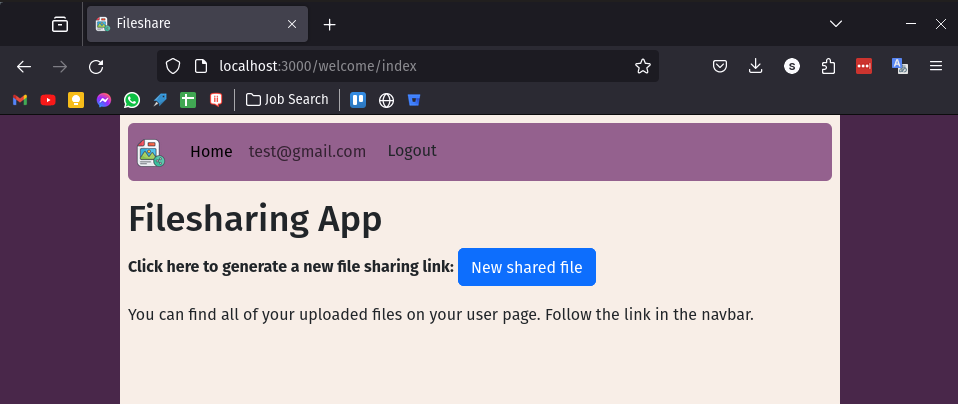
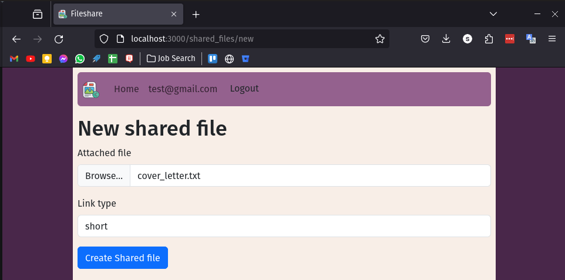
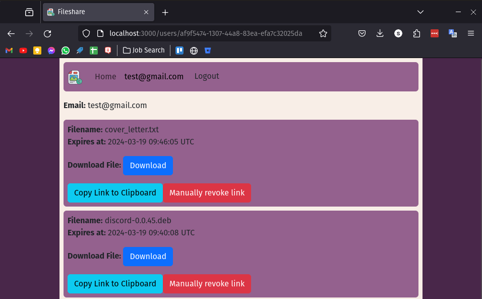
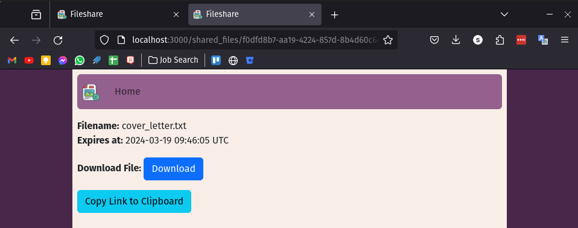

# Simon Cadge PicCollage File Sharing Take Home Quiz

### Live Site Available Here: http://15.152.41.197:3000

**Disclaimer: The clipboard functionality in modern browsers is restricted to secure origins. If you run the application locally it will work, but since I haven't configured https for prod use the clipboard functionality at http://15.152.41.197:3000 isn't working. Here's what you can do instead:**
1. Upload your file
2. It should take you to the file's page, with a download button and a url that looks like `/shared_files/b1e0b1ed-abbf-4657-9c42-f665665df965`
3. Copy the entire URL. That is the sharing link

**Example file I have uploaded that you can access without needing to log in: http://15.152.41.197:3000/shared_files/7cbe7fc0-15de-4c7f-8e5b-c96548ed8606**

Welcome to my PicCollage take home quiz. My submission provides all of the required features, as well as user registration, the ability to manually revoke links, and a choice of how long the link should remain alive.  
After logging in Users are directed to the new shared_file page where they can upload a file.  
Once they have uploaded the file a link is generated which they can copy to the clipboard by clicking on a button. Anyone can access the download page by using that link.  
On the user's page they can see all of their uploaded files and manually revoke the links of any that are still active, but there isn't any other way to list files, so unless someone can guess a UUID of another file they won't be able to access someone else's data.    

Tests make use of active storage fixtures so we can easily test the file upload/download functionality.  
Running `rails test:all` will run Controller, Model and System tests.  

### Screenshots:
Homepage:  
  
New File Page:  
  
User page listing their uploads:  
  
Download page accessed via the share link by a user who isn't logged in:  
  

### To Run Locally:
 1. Ensure docker desktop / docker engine is running on your system.
 2. Create a .env file in the root directory containing the following variables:
    - DB_PASSWORD='whatever password you like'
    - DB_USER='whatever username you like'
    - DB_HOST=db
    - RAILS_MASTER_KEY='the encryption key generated by rails. This shouldn't be uploaded to version control so you'll need to ask me for this personally or generate a new one for yourself by deleting the `credentials.ymc.enc` file and then running `rails credentials:edit`
    - SHORT_LINK_VALID_MINUTES=How long a short link should be valid for
    - LONG_LINK_VALID_MINUTES=How long a long link should be valid for
    - STORAGE_SERVICE=local  (This tells it to use local storage rather than S3 even though it is running in production mode)
 3. Run `docker compose up --build`
    - This will start the postgres db first, wait for the db healthcheck to show as healthy, and then start the rails app
    - The rails app will be accessible at http://localhost:3000
